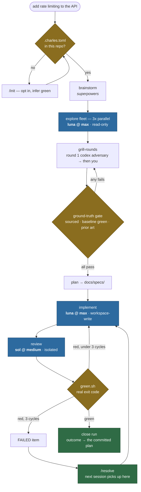
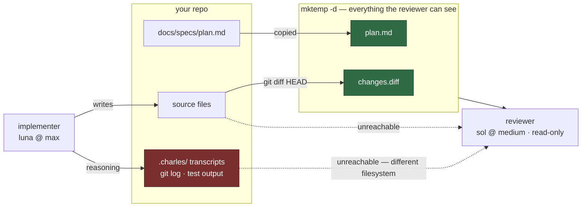

# charlesdr-dev-loop

Claude Code stops writing your code and starts running the shop. Exploration and
implementation go out to Codex models at max reasoning; a reviewer that has never
seen the implementer grades the result against the plan.

```bash
cd your-repo
/charlesdr-dev-loop:init                          # opt this repo in, once
/charlesdr-dev-loop:feature add rate limiting to the API
```

That single command runs the whole loop: brainstorm, three parallel explorers,
an adversarial grill of the plan, a ground-truth gate, implementation, isolated
review, then your test command until it passes.

---

## The loop



Blue is a Codex lane, amber is a gate that can send you backwards, green is an
exit. Claude Code owns the arrows and none of the boxes.

---

## The problem this solves

An agent that writes code and then checks its own code will tell you it works.
Not from dishonesty, but because the same reasoning that produced the bug
produces the argument that it is not a bug. Self-evaluation is an agreement
loop wearing the costume of a review.

The usual fix is to ask the model to be more critical. That fails, because you
are asking the biased party to correct for its own bias.

The fix here is structural. Three separations, none of which rely on a model
choosing to behave:

**The orchestrator does not implement.** Claude Code plans, routes, and judges.
The typing goes to a Codex lane. A `PreToolUse` hook enforces this: an edit over
the threshold gets stopped and told to dispatch instead.

**The reviewer cannot see the implementer.** The review lane runs in a
`mktemp -d` containing exactly two files, `plan.md` and `changes.diff`,
read-only. It cannot reach the repo, the transcripts, or `git log`. It is not
asked to ignore the implementer's reasoning; it is unable to find it.



The dotted edges are not policy. There is no path from the implementer's
reasoning to the reviewer's working directory, so there is nothing to enforce.

**The grill happens before the code, not after.** A plan gets attacked by an
adversary whose job is to find the reason it fails, and every attack must be
answered from source before implementation starts.

---

## Requirements

This wraps tools it does not ship. Before installing:

- **[Codex CLI](https://github.com/openai/codex)** on PATH, authenticated.
- **A `luna` Codex profile** at `~/.codex/luna.config.toml` — this is the
  primary engine, and without it nothing dispatches:

  ```toml
  model = "gpt-5.6-luna"
  model_reasoning_effort = "max"
  ```

- **`jq`**, or both hooks fail open and silently allow everything.
- **Optional — the deepseek fallback.** It shells out to a `codex-ds.sh`
  wrapper at `~/.claude/skills/codex-deepseek/scripts/codex-ds.sh`, which is
  **not included in this repo**. Without it you lose the fallback engine, not a
  lane; `doctor` reports this as WARN rather than FAIL. Point `DS_SCRIPT` in
  `scripts/codex-run.sh` at your own wrapper if you have one.
- **Optional — `treehouse`** (a pre-warmed git-worktree pool for parallel agents) for
  parallel implementers. Serial implementation works without it.

Run `/charlesdr-dev-loop:doctor` after install; it tells you exactly which of
these is missing and what each one costs you.

## Install

As a plugin, which is the normal path:

```bash
/plugin marketplace add charlesdr13/charlesdr-dev-loop
/plugin install charlesdr-dev-loop@charlesdr-dev-loop
```

Then check every lane resolves:

```bash
/charlesdr-dev-loop:doctor
```

As plain skills, for a harness without plugin support:

```bash
bash scripts/install-skills.sh          # --copy for an independent copy
```

The skill-only path gives you the two skills and `codex-run` on PATH. It does
not give you the agents, the commands, or the hook.

---

## Opting a repo in

```bash
/charlesdr-dev-loop:init
```

Writes `.charles.toml`, committed on purpose:

```toml
green = "bun test && bun run typecheck"   # what "all green" means here
inline_lines = 40
inline_files  = 3
```

Nothing in this plugin does anything in a repo without that file. No hook, no
auto-routing. One switch, per repo, deliberately: enforcement you did not opt
into in *this* repo is just friction.

`green` is inferred from the repo at init time. Check it. A wrong green command
makes the debug loop confidently meaningless.

It is executed, not narrated — `scripts/green.sh` reads it, runs it, and exits
with its status, so the debug loop terminates on a real exit code rather than on
a model's recollection. With no green command set it refuses to run: a loop that
cannot verify itself cannot honestly say it is finished.

---

## The three lanes

| Role | Engine | Effort | Sandbox |
|---|---|---|---|
| explore | gpt-5.6-luna | max | read-only |
| implement | gpt-5.6-luna | max | workspace-write |
| review | gpt-5.6-sol | medium | read-only, isolated temp dir |

luna at max is the primary engine for every dispatch. deepseek-v4-flash is the
fallback, tried automatically when luna fails, or forced with `--engine deepseek`
for a deliberately wide, cheap sweep.

**Speed.** `--fast` is shorthand for `--effort high`; `--effort max|high|medium`
sets it directly. Codex's `fast_mode` feature is globally on by default, so it is
enabled explicitly on luna and disabled on the review lane — that way "fast on
luna only" is literally true rather than inherited. Effort is the lever that
actually moves latency: a repo sweep at `max` ran 698s, a smaller one at `high`
ran 101s. Those were different questions, so treat it as a direction, not a
benchmark.

```bash
scripts/codex-run.sh --lane explore   --dir REPO "why does the refresh path 401?"
scripts/codex-run.sh --lane implement --dir REPO "add the RangeError guard from the plan"
scripts/codex-run.sh --lane review    --dir REPO --plan docs/specs/x.md "check every requirement"
```

(After `install-skills.sh` the same script is on PATH as `codex-run`. Under the
plugin install, the agents call it at `${CLAUDE_PLUGIN_ROOT}/scripts/codex-run.sh`
and you rarely invoke it by hand.)

Exploration and implementation both run on the strongest available reasoning,
on the view that a wrong exploration is more expensive than an expensive one.
The tradeoff is real: a five-wide luna sweep is not cheap, so size fleets to the
question rather than to the ceiling — and note that nothing enforces it, so it's judgment.

A dispatch that fails on luna retries once on deepseek, then hard-stops. It never falls
back to Claude doing the work inline. A fallback that fires on any error turns
"always dispatch" into "dispatch when convenient", which is the same as not
having the system.

---

### The dispatcher has a stable path

A `SessionStart` hook symlinks `~/.local/bin/codex-run` to the installed
plugin's copy of the script. Agents resolve `codex-run` from PATH first and only
fall back to `${CLAUDE_PLUGIN_ROOT}`.

That variable does not reliably expand inside an agent's shell. When it did not,
agents searched the filesystem, found the author's working checkout, and one of
them executed it mid-edit and died on a syntax error. Pointing at the installed
snapshot fixes both problems: the path is stable, and it is never someone's live
working tree.

### Concurrent writers are refused

A second `--lane implement` dispatch on a directory that already has one exits 4
rather than starting. Read-only explores alongside a writer are fine. Override
with `CHARLES_ALLOW_CONCURRENT_WRITES=1` if you genuinely mean it.

This exists because the docs promised worktree isolation that no code provided,
and a timed-out dispatch got re-dispatched while the original codex was still
writing to the same tree.

## Commands

| Command | When |
|---|---|
| `/charlesdr-dev-loop:feature <what>` | Building something new |
| `/charlesdr-dev-loop:debug <symptom>` | Something is broken |
| `/charlesdr-dev-loop:polish` | "What should I improve here" |
| `/charlesdr-dev-loop:init` | Opt this repo in |
| `/charlesdr-dev-loop:ui <route>` | UI/UX polish — routes to impeccable, adds a codex mechanical audit |
| `/charlesdr-dev-loop:resolve` | Pick up where the last run stopped |
| `/charlesdr-dev-loop:doctor` | Check every lane and dependency |

You do not have to type them. In an opted-in repo the flow triggers on intent —
"add rate limiting" is enough. The commands are for being explicit.

---

## Continuing a run

A flow that ends with open items used to end in prose, and the prose died with
the session. Every run now keeps state in `.charles/runs/<id>/RUN.md` — phases
with their pasted proof, the rollback command, and open items typed by who can
unblock them:

| Type | Meaning | Unblocked by |
|---|---|---|
| `BLOCKED-HUMAN` | needs a fact or reply only you have | you |
| `PENDING-DECISION` | ready to act, needs your yes | you |
| `DEFERRED` | deliberately out of scope | either |
| `FAILED` | a lane died, work incomplete | re-dispatch |

```bash
/charlesdr-dev-loop:resolve          # newest unclosed run
/charlesdr-dev-loop:resolve --list   # pick another
```

`resolve` surfaces `BLOCKED-HUMAN` first (usually two minutes of your time, and
everything downstream waits on them), confirms before re-dispatching a `FAILED`
lane, and closes only when every item is resolved *and* the flow reached its
final phase — a run that died at phase 3 is abandoned, not finished.

Where `tasks-axi` is installed it owns the items, since it already resurfaces
them at session start; otherwise they live in `RUN.md`.

Alongside this, `codex-run.sh` appends a receipt for every dispatch to
`.charles/dispatches.jsonl` — lane, engine, model, exit code. It is written by
the script, so a lane that fails records itself with no cooperation from any
model. That log is what makes the receipt rule enforceable. `scripts/verify-receipt.sh`
reads it and exits 0 (a lane ran), 1 (nothing ran — discard the report), or 2
(dispatches exist but all failed, e.g. `rc=143` when the harness killed one).

The pasted receipt line in a report is a courtesy: an agent can type it without
running anything. The dispatch log is written by the wrapper itself and cannot be
forged from inside a report, so that is what gets checked.

## UI polish is a router, not a flow

`/charlesdr-dev-loop:ui` deliberately does **not** implement UI judgment.
`impeccable` is a 27-command UI system whose `polish`
alone covers spacing, information architecture, typography, contrast,
interaction states, micro-interactions, content, icons and forms — and nine of
its references already handle the perf/a11y floor. Rebuilding that would have
produced a worse copy.

The router adds only what impeccable lacks: durable run state, one codex
explorer for the *mechanical* audit (token drift, off-scale spacing, duplicate
variants, dead styles — grep-shaped findings an eye misses), gsap routing for
motion work, and a `codex-reviewer` pass for scope creep, which is how polish
work actually goes wrong.

Taste never goes to a lane. luna gets a diff, never a picture, so anything
needing an eye becomes a `BLOCKED-HUMAN` item rather than a guess.

## The hooks

**Edits** — `PreToolUse` on `Edit|Write|MultiEdit`. In an opted-in repo, on a code file, it
asks you to dispatch instead when an edit touches at least `inline_lines`, or
when you have touched at least `inline_files` distinct files since the last
dispatch. The file counter matters more than the line counter: a three-file
change is a feature, even when each edit is small.

Always allowed: new files, non-code extensions, repos without `.charles.toml`,
and everything when `CHARLES_INLINE_OK=1`.

**Subagents** — `PreToolUse` on `Agent|Task`. Stopping Claude from typing the
code achieves nothing if it can hand the same work to one of its own subagents
instead. So spawning `Explore`, `general-purpose`, `Plan`, `feature-dev:*` or a
language specialist in an opted-in repo asks you to use a codex lane instead.
It is a denylist of agents that do repo code work — `google-drive`,
`claude-code-guide` and the rest are none of this hook's business.

**Unclosed runs** — a `Stop` hook warns when a run has `FAILED` items. Only
`FAILED`: the others already resurface via `tasks-axi`, and warning twice is
nagging.

**Known hole, on purpose.** Writes through Bash (`sed -i`, heredocs, `tee`) are
not intercepted. Matching those would fire on every `bun test > out.log` and the
hook would be switched off within a day. The hook is a backstop. The `charles-flow`
skill is what actually keeps the work routed.

---

## The ground-truth gate

Three checks, before any implementation, none of them optional:

1. **Claims are sourced.** Every factual claim in the plan cites `file:line`.
   Extrapolating from a package name is not verification.
2. **Baseline is green.** Run `green` *before* touching anything, or you will
   attribute an existing failure to your change.
3. **Prior art checked.** If the thing already exists, building it again is the
   most expensive available outcome.

And the proof protocol throughout: `"47 passed, 0 failed"`, not "tests pass".
`"312 lines"`, not "file written". Assertions without output are how a loop
convinces itself it is finished.

---

## Test

```bash
bash scripts/selftest.sh   # 23 assertions: both PreToolUse hooks, run state, Stop hook
bash scripts/doctor.sh     # every lane, every dependency, this repo's config
```

Both are expected to exit non-zero when something is genuinely wrong. `doctor`
distinguishes FAIL (a dead lane) from WARN (a degraded capability).

---

## Acknowledgements

This plugin is mostly other people's ideas, arranged for one person's workflow.

[**loop-engineer**](https://github.com/LeadGrowGTM/loop-engineer) by
**Mitchell Keller ([@MitchellkellerLG](https://github.com/MitchellkellerLG))**
is where the two load-bearing ideas come from: the proof protocol, and grading
in a context that never saw the maker. Its four-agent harness solves the unattended case;
this solves the supervised one, and borrows without depending. No runtime link
between them — the ideas travelled, the code did not.

[**superpowers**](https://github.com/obra/superpowers) by Jesse Vincent (MIT)
provides the brainstorming discipline the feature flow opens with. The flow
overrides its terminal state — brainstorming here hands off to the grill rather
than to `writing-plans` — which is a deviation from its design, not a defect in it.

[**mattpocock/skills**](https://github.com/mattpocock/skills) by Matt Pocock
(MIT) is the origin of `grill-me`, which `grill-rounds` forks: same relentless
interrogation, bounded to two or three rounds and front-loaded with an automated
adversary so it can run unattended. Its `diagnose` and `tdd` skills are called
unmodified. Forking rather than editing was a practical decision — installed
plugin caches get overwritten on marketplace update, so an edit in place has a
lifespan measured in days.

[**OpenAI Codex CLI**](https://github.com/openai/codex) is the wire for all
three lanes. It speaks the Responses API, which honours `reasoning_effort` —
the reason `max` is reachable here at all.

**treehouse** provides the pre-warmed worktree pool that makes parallel
implementers safe.

The `codex-deepseek` dispatch wrapper this builds on was written for an earlier
project and is reused rather than reimplemented.
