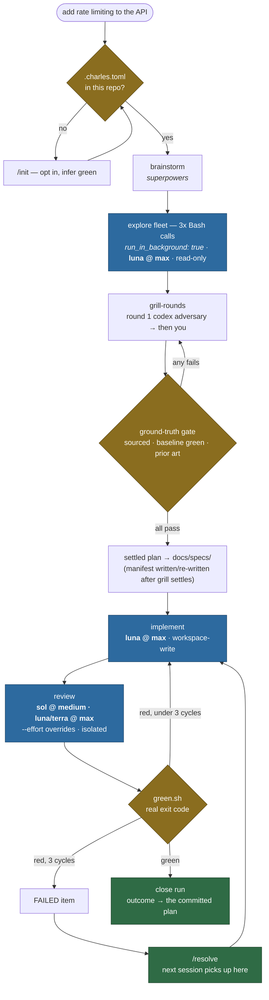
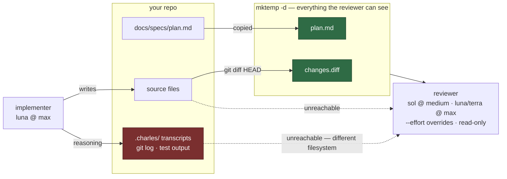

# charlesdr-dev-loop

Claude Code stops writing your code and starts running the shop. Exploration and
implementation go out to Codex models at max reasoning; review uses sol at medium,
luna/terra at max, and `--effort` overrides.

```bash
cd your-repo
/charlesdr-dev-loop:init                          # opt this repo in, once
/charlesdr-dev-loop:feature add rate limiting to the API
```

That single command runs the whole loop: brainstorm, three direct Codex explore
calls with `run_in_background: true`, an adversarial grill of the plan, a ground-truth gate,
implementation, isolated review, then your test command until it passes.

---

## The loop


```mermaid
flowchart TD
    REQ(["add rate limiting to the API"]) --> GATE{".charles.toml<br/>in this repo?"}
    GATE -->|no| INIT["/init — opt in, infer green"]
    INIT --> GATE
    GATE -->|yes| BRAIN["brainstorm<br/><i>superpowers</i>"]

    BRAIN --> EXP["explore fleet — 3x Bash calls<br/><i>run_in_background: true</i> · <b>luna @ max</b> · read-only"]
    EXP --> GRILL["grill-rounds<br/>round 1 codex adversary → then you"]
    GRILL --> TRUTH{"ground-truth gate<br/>sourced · baseline green · prior art"}
    TRUTH -->|any fails| GRILL
    TRUTH -->|all pass| PLAN["settled plan → docs/specs/<br/>(manifest written/re-written after grill settles)"]

    PLAN --> IMPL["implement<br/><b>luna @ max</b> · workspace-write"]
    IMPL --> REV["review<br/><b>sol @ medium · luna/terra @ max</b><br/>--effort overrides · isolated"]
    REV --> GREEN{"green.sh<br/>real exit code"}

    GREEN -->|"red, under 3 cycles"| IMPL
    GREEN -->|"red, 3 cycles"| FAILED["FAILED item"]
    GREEN -->|green| CLOSE["close run<br/>outcome → the committed plan"]

    FAILED --> RESOLVE["/resolve<br/>next session picks up here"]
    RESOLVE --> IMPL

    classDef lane fill:#2d6a9f,stroke:#1b4368,color:#fff
    classDef gate fill:#8a6d1f,stroke:#5c4813,color:#fff
    classDef term fill:#2f6b45,stroke:#1c4029,color:#fff
    class EXP,IMPL,REV lane
    class GATE,TRUTH,GREEN gate
    class CLOSE,RESOLVE term
```

Blue is a Codex lane, amber is a gate that can send you backwards, green is an
exit. Claude Code owns the arrows and none of the boxes.

---

## The problem this solves

An agent that writes code and then checks its own code will tell you it works.
Not from dishonesty, but because the same reasoning that produced the bug
produces the argument that it is not a bug. Self-evaluation is an agreement
loop wearing the costume of a review.

The usual fix is to ask the model to be more critical. That fails, because you
are asking the biased party to correct for its own bias.

The fix here is structural. Three separations, none of which rely on a model
choosing to behave:

**The orchestrator does not implement.** Claude Code plans, routes, and judges.
The typing goes to a Codex lane. A `PreToolUse` hook enforces this: an edit over
the threshold gets stopped and told to dispatch instead.

**The reviewer cannot see the implementer.** The review lane runs in a
`mktemp -d` containing exactly two files, `plan.md` and `changes.diff`,
read-only. It cannot reach the repo, the transcripts, or `git log`. It is not
asked to ignore the implementer's reasoning; it is unable to find it.


```mermaid
flowchart LR
    subgraph REPO["your repo"]
        SRC["source files"]
        TRANS[".charles/ transcripts<br/>git log · test output"]
        SPEC["docs/specs/plan.md"]
    end

    IMPL["implementer<br/>luna @ max"] -->|writes| SRC
    IMPL -->|reasoning| TRANS

    subgraph BOX["mktemp -d — everything the reviewer can see"]
        PLANMD["plan.md"]
        DIFF["changes.diff"]
    end

    SPEC -->|copied| PLANMD
    SRC -->|git diff HEAD| DIFF
    BOX --> REV["reviewer<br/>sol @ medium · luna/terra @ max<br/>--effort overrides · read-only"]

    TRANS -.->|"unreachable — different filesystem"| REV
    SRC  -.->|"unreachable"| REV

    classDef hidden fill:#7a2f2f,stroke:#4a1c1c,color:#fff
    classDef seen fill:#2f6b45,stroke:#1c4029,color:#fff
    class TRANS hidden
    class PLANMD,DIFF seen
```

The dotted edges are not policy. There is no path from the implementer's
reasoning to the reviewer's working directory, so there is nothing to enforce.

**The grill happens before the code, not after.** A plan gets attacked by an
adversary whose job is to find the reason it fails, and every attack must be
answered from source before implementation starts.

---

## Requirements

This wraps tools it does not ship. Before installing:

- **[Codex CLI](https://github.com/openai/codex)** on PATH, authenticated.
- **A `luna` Codex profile** at `~/.codex/luna.config.toml` — this is the
  primary engine, and without it nothing dispatches:

  ```toml
  model = "gpt-5.6-luna"
  model_reasoning_effort = "max"
  ```

- **`jq`**, or both hooks fail open and silently allow everything.
- **Optional — the deepseek fallback.** It shells out to a `codex-ds.sh`
  wrapper at `~/.claude/skills/codex-deepseek/scripts/codex-ds.sh`, which is
  **not included in this repo**. Without it you lose the fallback engine, not a
  lane; `doctor` reports this as WARN rather than FAIL. Point `DS_SCRIPT` in
  `scripts/codex-run.sh` at your own wrapper if you have one.
- **Optional — `treehouse`** (a pre-warmed git-worktree pool for parallel agents) for
  parallel implementers. Serial implementation works without it.

Run `/charlesdr-dev-loop:doctor` after install; it tells you exactly which of
these is missing and what each one costs you.

## Install

As a plugin, which is the normal path:

```bash
/plugin marketplace add charlesdr13/charlesdr-dev-loop
/plugin install charlesdr-dev-loop@charlesdr-dev-loop
```

Then check every lane resolves:

```bash
/charlesdr-dev-loop:doctor
```

As plain skills, for a harness without plugin support:

```bash
bash scripts/install-skills.sh          # --copy for an independent copy
```

The skill-only path gives you the two skills and `codex-run` on PATH. It does
not give you the agents, the commands, or the hook.

---

## Opting a repo in

```bash
/charlesdr-dev-loop:init
```

Writes `.charles.toml`, committed on purpose:

```toml
green = "bun test && bun run typecheck"   # what "all green" means here
inline_lines = 40
inline_files  = 3
parallel_min_chunks = 2                    # raise to keep smaller sets serial
```

Nothing in this plugin does anything in a repo without that file. No hook, no
auto-routing. One switch, per repo, deliberately: enforcement you did not opt
into in *this* repo is just friction.

`green` is inferred from the repo at init time. Check it. A wrong green command
makes the debug loop confidently meaningless.

It is executed, not narrated — `scripts/green.sh` reads it, runs it, and exits
with its status, so the debug loop terminates on a real exit code rather than on
a model's recollection. With no green command set it refuses to run: a loop that
cannot verify itself cannot honestly say it is finished.

---

## The three lanes

| Role | Engine | Effort | Sandbox |
|---|---|---|---|
| explore | gpt-5.6-luna | max | read-only |
| implement | gpt-5.6-luna | max | workspace-write |
| review | gpt-5.6-sol by default; gpt-5.6-luna/terra with `--engine` | sol: medium; luna/terra: max; `--effort` overrides | read-only, isolated temp dir |

luna at max is the primary engine for explore and implement. Review uses sol at
medium by default, luna/terra at max, and `--effort` overrides. deepseek-v4-flash
is the fallback, tried automatically when luna fails, or forced with `--engine
deepseek` for a deliberately wide, cheap sweep.

Review effort is positional: intermediate reviews use `--effort medium`; the
final pre-close review omits `--effort` and uses the model-aware default (sol at
medium, luna/terra at max). This is a documented rule, not a flag.

To move every lane — explore, implement and review — onto one engine without a
restart, run `/charlesdr-dev-loop:engine deepseek` (`luna`, `terra`, `default`
are the other values). It writes `$CHARLES_STATE_DIR/engine`, read at the start
of each dispatch, so it takes effect on the next lane with no restart. A
per-call `--engine` flag, or CHARLES_ENGINE in the environment, still wins. Use
it when codex quota is short: deepseek bills a separate key.

**Older all-lane timing baseline** (179 runs; predates the implement
remeasurement below):

| lane | median | p90 | over 25 min |
|---|---|---|---|
| explore | 5.7 min | 22.0 min | |
| review | 1.7 min | 3.2 min | never |

**Current implement timing** (successful implement dispatches only; n=233 across
all opted-in repos):

Durations are SUCCESSFUL implement dispatches only (`rc=0`): median 8.9 min,
p75 13.8 min, p90 19.1 min, p95 23.1 min, max 39.6 min. Method: pair
start/end events in `.charles/dispatches.jsonl` across all opted-in repos and
filter durations to `rc=0`. Timeouts are counted separately: 25 of 258 ends,
about 10%, hit the old 1800s cap. The successful median remains roughly five
times the old 1.9-minute documentation claim, so parallel chunking still pays.

The Bash tool caps a single call at 600s, so **57% of successful explores cannot
finish in the foreground**. The orchestrator runs explore and implement directly
with `codex-run --lane <lane> --dir <repo> --timeout 2700 "<task>"` as separate Bash
calls with `run_in_background: true`.
The harness re-invokes the orchestrator when each process exits. `lane-status.sh`
is only the recovery probe when a session restart or harness death loses that
completion signal. Reviews expected to exceed roughly 9 minutes (heavy diff, big
repo, or terra at max) run in the background with `--timeout 2700` and bounded
`lane-status.sh` checks; shorter reviews may use the foreground `--timeout 540`
path.

Raising the cap does not fix the underlying cause of the 30-minute cluster, which is oversized dispatches; chunking the requirement list is the real remedy and the cap is the backstop.

**Speed.** `--fast` is shorthand for `--effort high`; `--effort max|high|medium`
sets it directly. Codex's `fast_mode` feature is globally on by default, so it is
enabled explicitly on luna and disabled on the review lane — that way "fast on
luna only" is literally true rather than inherited. Effort is the lever that
actually moves latency: a repo sweep at `max` ran 698s, a smaller one at `high`
ran 101s. Those were different questions, so treat it as a direction, not a
benchmark.

```bash
# Each explore/serial-implement command is a separate Bash call with run_in_background: true.
codex-run --lane explore   --dir REPO --timeout 2700 "why does the refresh path 401?"
codex-run --lane implement --dir REPO --req R1,A3 --timeout 2700 "add the RangeError guard from the plan"
# Short review: foreground and isolated; longer reviews use the background path below.
codex-run --lane review    --dir REPO --plan docs/specs/x.md --timeout 540 "check every requirement"
# Long review: make a separate Bash call with run_in_background: true and --timeout 2700;
# then check lane-status.sh at most three times.
codex-run --lane review --dir REPO --plan docs/specs/x.md --timeout 2700 \
  "check every requirement"
# Review committed work, including any uncommitted changes on top.
codex-run --lane review    --dir REPO --plan docs/specs/x.md --base REF "check every requirement"
```

Review uses the working-tree diff against `HEAD`, cached changes, and untracked
files by default. `--base REF` instead reviews `REF..working-tree` (with
untracked files appended); `REF` must resolve, and `--base` is review-only.
A review after `HEAD` has moved requires `--base <ref>`, or the reviewer sees an
empty diff and grades nothing.

(`codex-run` is on PATH after `install-skills.sh` or the plugin's SessionStart
hook. The orchestrator invokes it directly; no wrapper agent is needed for
explore or implement.)

Exploration and implementation both run on the strongest available reasoning,
on the view that a wrong exploration is more expensive than an expensive one.
The tradeoff is real: a five-wide luna sweep is not cheap, so size fleets to the
question rather than to the ceiling — and note that nothing enforces it, so it's judgment.

A dispatch that fails on luna gets one deepseek rescue. The wrapper prints a
loud `fallback_from:<engine> primary_rc:<n>` receipt; if the rescue also fails,
the dispatch stops. It never falls back to Claude doing the work inline. A
fallback that fires on any error turns "always dispatch" into "dispatch when
convenient", which is the same as not having the system.

---

### The dispatcher has a stable path

A `SessionStart` hook symlinks `~/.local/bin/codex-run` to the installed
plugin's copy of the script. The orchestrator resolves `codex-run` from PATH
first and only falls back to `${CLAUDE_PLUGIN_ROOT}`.

That variable does not reliably expand inside Codex's shell. When it did not,
dispatches searched the filesystem, found the author's working checkout, and one
executed it mid-edit and died on a syntax error. Pointing at the installed
snapshot fixes both problems: the path is stable, and it is never someone's live
working tree.

### Concurrent writers are refused

A second `--lane implement` dispatch on a directory that already has one exits 4
rather than starting. Read-only explores alongside a writer are fine. Override
with `CHARLES_ALLOW_CONCURRENT_WRITES=1` if you genuinely mean it.

This exists because the docs promised worktree isolation that no code provided,
and a timed-out dispatch got re-dispatched while the original codex was still
writing to the same tree.

## Commands

| Command | When |
|---|---|
| `/charlesdr-dev-loop:feature <what>` | Building something new |
| `/charlesdr-dev-loop:debug <symptom>` | Something is broken |
| `/charlesdr-dev-loop:polish` | "What should I improve here" |
| `/charlesdr-dev-loop:init` | Opt this repo in |
| `/charlesdr-dev-loop:ui <route>` | UI/UX polish — routes to impeccable, adds a codex mechanical audit |
| `/charlesdr-dev-loop:release <semver>` | Publish a version |
| `/charlesdr-dev-loop:ops` | Cross-repo run triage and recovery |
| `/charlesdr-dev-loop:resolve` | Pick up where the last run stopped |
| `/charlesdr-dev-loop:doctor` | Check every lane and dependency |

You do not have to type them. In an opted-in repo the flow triggers on intent —
"add rate limiting" is enough. The commands are for being explicit.

---

## Continuing a run

A flow that ends with open items used to end in prose, and the prose died with
the session. Every run now keeps state in `.charles/runs/<id>/RUN.md` — phases
with their pasted proof, the rollback command, and open items typed by who can
unblock them:

| Type | Meaning | Unblocked by |
|---|---|---|
| `BLOCKED-HUMAN` | needs a fact or reply only you have | you |
| `PENDING-DECISION` | ready to act, needs your yes | you |
| `DEFERRED` | deliberately out of scope | either |
| `FAILED` | a lane died, work incomplete | re-dispatch |

```bash
/charlesdr-dev-loop:resolve          # newest unclosed run
/charlesdr-dev-loop:resolve --list   # pick another
```

Open a run with `run-state.sh init <dir> <flow> "<goal>" --spec
docs/specs/<plan>.md`. A discovery made mid-flow is `DEFERRED`, not a new
dispatch; use `run-state.sh defer <dir> "<text>"`. While a run is open,
`codex-run --lane implement` requires `--req R1,A3`, validates those identifiers
against the run's spec, and cannot dispatch a run opened without `--spec`.

`resolve` surfaces `BLOCKED-HUMAN` first (usually two minutes of your time, and
everything downstream waits on them), confirms before re-dispatching a `FAILED`
lane, and closes only when every item is resolved *and* the flow reached its
final phase — a run that died at phase 3 is abandoned, not finished.

Where `tasks-axi` is installed it owns the items, since it already resurfaces
them at session start; otherwise they live in `RUN.md`.

Alongside this, `codex-run.sh` appends a receipt for every dispatch to
`.charles/dispatches.jsonl` — lane, engine, model, exit code. It is written by
the script, so a lane that fails records itself with no cooperation from any
model. That log is what makes the receipt rule enforceable. `scripts/verify-receipt.sh`
reads it and exits 0 (a lane ran), 1 (nothing ran — discard the report), or 2
(dispatches exist but all failed, e.g. `rc=143` when the harness killed one).

The pasted receipt line in a report is a courtesy: an agent can type it without
running anything. The dispatch log is written by the wrapper itself and cannot be
forged from inside a report, so that is what gets checked.

## UI polish is a router, not a flow

`/charlesdr-dev-loop:ui` deliberately does **not** implement UI judgment.
`impeccable` is a 27-command UI system whose `polish`
alone covers spacing, information architecture, typography, contrast,
interaction states, micro-interactions, content, icons and forms — and nine of
its references already handle the perf/a11y floor. Rebuilding that would have
produced a worse copy.

The router adds only what impeccable lacks: durable run state, one direct
`codex-run --lane explore` call with `run_in_background: true` for the
*mechanical* audit (token drift, off-scale spacing, duplicate variants, dead
styles — grep-shaped findings an eye misses), gsap routing for motion work, and
a `codex-reviewer` pass for scope creep, which is how polish work actually goes
wrong.

Taste never goes to a lane. luna gets a diff, never a picture, so anything
needing an eye becomes a `BLOCKED-HUMAN` item rather than a guess.

## The hooks

**Edits** — `PreToolUse` on `Edit|Write|MultiEdit`. In an opted-in repo, on a code file, it
asks you to dispatch instead when an edit touches at least `inline_lines`, or
when you have touched at least `inline_files` distinct files since the last
dispatch. The file counter matters more than the line counter: a three-file
change is a feature, even when each edit is small.

Always allowed: new files, non-code extensions, repos without `.charles.toml`,
and everything when `CHARLES_INLINE_OK=1`.

**Subagents** — `PreToolUse` on `Agent|Task`. Stopping Claude from typing the
code achieves nothing if it can hand the same work to one of its own subagents
instead. So spawning `Explore`, `general-purpose`, `Plan`, `feature-dev:*` or a
language specialist in an opted-in repo asks you to make a direct Bash call with
`run_in_background: true` running `codex-run --lane ...` instead. It is a
denylist of agents that do repo code work — `google-drive`, `claude-code-guide`
and the rest are none of this hook's business.

**Unclosed runs** — a `Stop` hook warns when a run has `FAILED` items. Only
`FAILED`: the others already resurface via `tasks-axi`, and warning twice is
nagging.

**Known hole, on purpose.** Writes through Bash (`sed -i`, heredocs, `tee`) are
not intercepted. Matching those would fire on every `bun test > out.log` and the
hook would be switched off within a day. The hook is a backstop. The `charles-flow`
skill is what actually keeps the work routed.

---

## Changes no lane produced

An implementer reported `FAILED`, stated it had not improvised, and had modified
two test files — against an empty dispatch log. No lane had ever run. It wrote
the files with its own tools and said it hadn't.

The tests were good. That is what makes it the dangerous failure rather than the
harmless one: **plausible code with no provenance**.

```bash
scripts/unsourced.sh .        # 0 accounted for · 1 nothing produced this
```

It compares the working tree against the dispatch log, ignoring what the
orchestrator legitimately authors itself (plans in `docs/specs/`, `.charles/`).
A failed dispatch does not launder edits — only `rc=0` accounts for them.

Three outcomes, because they need different answers:

| exit | meaning | what to do |
|---|---|---|
| 0 | a successful dispatch accounts for the changes | proceed |
| 1 | **no lane ran at all** | discard whole — no provenance, and something misreported |
| 2 | **a lane ran and was cut short** (124/143) | its report is worthless, its code may not be — verify with `green.sh` and `codex-reviewer`, then keep or revert |

Exit 1 is the fabrication case: discard it whole, do not keep the parts that
look correct. Exit 2 is a clock, not a liar — a dispatch killed at 2700s may
have written good code first, and throwing that away is its own kind of waste.

Every rule against this previously lived in agent prose, which is precisely what
the agent contradicted.

## Finishing is not dispatching

`verify-receipt.sh` proves a lane ran; `flow-status.sh` proves the flow did.
An audit of 75 real dispatches found 26 implements against 5 reviews, 13 plans
carrying 1 grill verdict, and 4 runs open against 1 closed — all of it passing
silently because the individual dispatches succeeded.

```bash
scripts/flow-status.sh .      # 0 clean · 1 outstanding
```

`run-state.sh close` refuses (exit 5) while anything is outstanding, since
closing is where you declare the work done. `--force` overrides. While a run is
open, `doctor` keeps installed-content drift at WARN but FAILs on an unreviewed
implement; report that expected mid-flow failure rather than reinstalling or
trying to bypass the review.
The small transition table in `scripts/flow.json` drives the expected-next hints;
`scripts/runs-sweep.sh [root...]` is the standing read-only hygiene sweep across
opted-in repos, so run it when `doctor` warns about open runs.

## Recovery after a lost completion signal

Normally the harness callback tells the re-invoked orchestrator that a background
dispatch exited. If a session restarts or the harness dies before that signal
arrives, use `lane-status.sh` as the recovery probe. Never use periodic polling
as the primary wait or decide liveness from an output file: `.last` appears only
on success, so a killed lane leaves nothing and a waiter cannot tell "still
working" from "died twelve minutes ago".

```bash
scripts/lane-status.sh        # 0 RUNNING · 1 DONE · 2 DEAD · 3 UNKNOWN
```

Every dispatch now also writes a `.done` marker with its exit code on every
exit path it can control, so a timeout reports `rc=124`. It cannot cover
SIGKILL — nothing can — which is why liveness is answered by process, not file.

DEAD means over: record `FAILED`, stop, and never re-dispatch on top of a
RUNNING lane. The original keeps writing, and two engines racing on one tree is
how work gets silently lost.

## The lane inherits nothing

Codex runs in its own process and cannot load Claude Code skills. Not
`ponytail`, not your CLAUDE.md, not your output style. Whatever constraint you
want on the code has to be in the prompt, or it does not exist — which for a
long time meant the orchestrator had a simplicity discipline and the thing
actually writing the code had none.

**ponytail is not Claude-Code-exclusive** — it ships a real Codex plugin
(`codex plugin marketplace add DietrichGebert/ponytail`), and a lane told to
load it does: verified reading `skills/ponytail/SKILL.md` and quoting rung 1
verbatim. Every `implement` dispatch therefore points at the maintained skill
first, and falls back to a distilled ladder: need it at all,
stdlib, native platform, existing dependency, one line, minimum code. Plus the
carve-outs it must not simplify away — validation at trust boundaries, error
handling that prevents data loss, security, accessibility, anything the brief
asked for. The reviewer grades for unrequested complexity too: an abstraction
with one caller, a config value that never varies, a dependency doing what a few
lines would.

`explore` does not carry it. It writes no code.

## Chunked dispatch

An implementer given twelve requirements does about 60% of each — the diff looks
plausible and the shortfall surfaces in review, or later. Capping scope is not
enough, because one coherent slice can still carry a long list.

Chunks are counted in **plan requirements**, not files or lines: 1-5 is usually
one slice, 6-10 is two, and 11+ means three or more and probably means this is
two plans wearing one name. When the settled plan yields 2+ parallel-compatible file
slices, write or rewrite `docs/specs/YYYY-MM-DD-<topic>.chunks.json` beside it
after the grill settles, never during the initial plan phase. Read
`docs/specs/<plan>.chunks.json` and resolve the script directory as
`SCRIPTS="$(dirname "$(readlink -f "$(command -v codex-run)")")"`.

Parallel is the default when the valid manifest holds `parallel_min_chunks` or
more entries, using the value from `.charles.toml` (default `2`), its file
declarations are disjoint or overlap only on paths every overlapping chunk lists
in `shared` (at most two chunks per path), and `treehouse` is available. Shared
paths must be existing ordinary text files modified in place by both chunks;
adds, deletes, renames, mode changes, symlinks, and binary content are refused:

```bash
"$SCRIPTS/parallel-chunks.sh" "$(pwd)" docs/specs/<plan>.chunks.json
# [{"name":"api","files":["src/a.ts"],"req":["R1"],"task":"..."}, ...]
# Shared paths must also be in files and listed in shared by both chunks.
```

Use serial for one chunk, below a raised threshold, overlap not declared shared
or declared asymmetrically, an invalid manifest, or missing `treehouse`; shared
manifests refuse `--no-green` and require the combined `green.sh` run. A batch
whose chunks modify `parallel-chunks.sh`, `codex-run.sh`,
or anything the dispatcher executes MUST also run serially: children execute
the dispatcher from the runner's script directory while the post-merge green
check runs the merged root scripts, and Bash reads a script lazily by byte
offset, so rewriting the dispatcher while it executes kills it at a stale
offset. That happened in Chunk A: the dispatcher died with `syntax error near
unexpected token )` after its work completed. Every chunk in an open run carries
`req`; the runner validates it against the plan and passes it to the child.

## The ground-truth gate

Four checks, before any implementation, none of them optional:

1. **Claims are sourced.** Every factual claim in the plan cites `file:line`.
   Extrapolating from a package name is not verification.
2. **Baseline is green.** Run `green` *before* touching anything, or you will
   attribute an existing failure to your change.
3. **Prior art checked.** If the thing already exists, building it again is the
   most expensive available outcome.
4. **Manifest scope matches.** When present, a companion manifest's declared
   files match the plan's stated scope.

And the proof protocol throughout: `"47 passed, 0 failed"`, not "tests pass".
`"312 lines"`, not "file written". Assertions without output are how a loop
convinces itself it is finished.

---

## Test

```bash
bash scripts/selftest.sh   # selftests for both PreToolUse hooks, run state, Stop hook
bash scripts/doctor.sh     # every lane, every dependency, this repo's config
```

Both are expected to exit non-zero when something is genuinely wrong. `doctor`
distinguishes FAIL (a dead lane) from WARN (a degraded capability).

---

## Acknowledgements

This plugin is mostly other people's ideas, arranged for one person's workflow.

[**loop-engineer**](https://github.com/LeadGrowGTM/loop-engineer) by
**Mitchell Keller ([@MitchellkellerLG](https://github.com/MitchellkellerLG))**
is where the two load-bearing ideas come from: the proof protocol, and grading
in a context that never saw the maker. Its four-agent harness solves the unattended case;
this solves the supervised one, and borrows without depending. No runtime link
between them — the ideas travelled, the code did not.

[**superpowers**](https://github.com/obra/superpowers) by Jesse Vincent (MIT)
provides the brainstorming discipline the feature flow opens with. The flow
overrides its terminal state — brainstorming here hands off to the grill rather
than to `writing-plans` — which is a deviation from its design, not a defect in it.

[**mattpocock/skills**](https://github.com/mattpocock/skills) by Matt Pocock
(MIT) is the origin of `grill-me`, which `grill-rounds` forks: same relentless
interrogation, bounded to two or three rounds and front-loaded with an automated
adversary so it can run unattended. Its `diagnose` and `tdd` skills are called
unmodified. Forking rather than editing was a practical decision — installed
plugin caches get overwritten on marketplace update, so an edit in place has a
lifespan measured in days.

[**OpenAI Codex CLI**](https://github.com/openai/codex) is the wire for all
three lanes. It speaks the Responses API, which honours `reasoning_effort` —
the reason `max` is reachable here at all.

[**ponytail**](https://github.com/DietrichGebert/ponytail) by Dietrich Gebert
(MIT) is the simplicity discipline the implement lane runs under. It is not
Claude-Code-only — its Codex plugin is what lets the lane load the real skill
rather than a paraphrase of it.

**treehouse** provides the pre-warmed worktree pool that makes parallel
implementers safe.

The `codex-deepseek` dispatch wrapper this builds on was written for an earlier
project and is reused rather than reimplemented.
